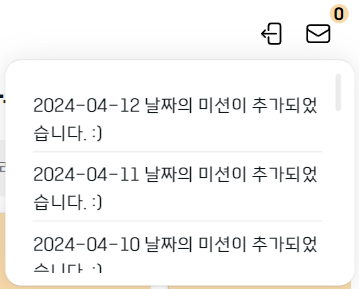
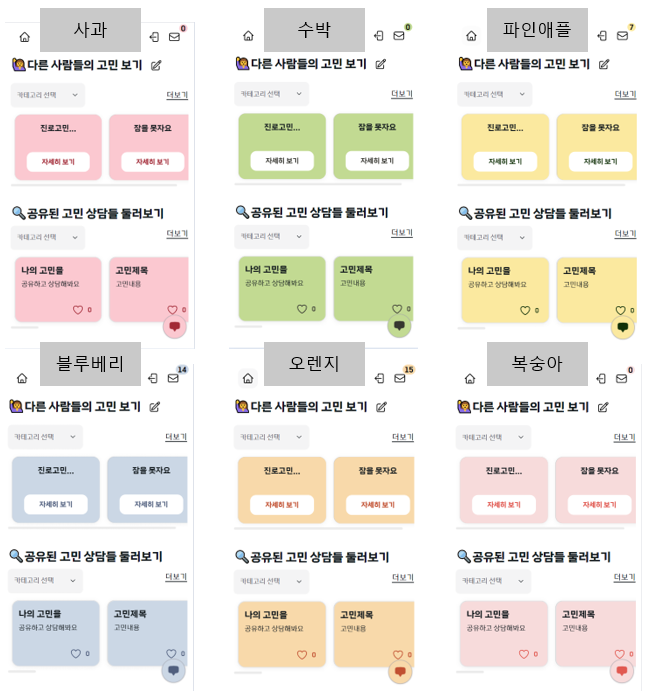
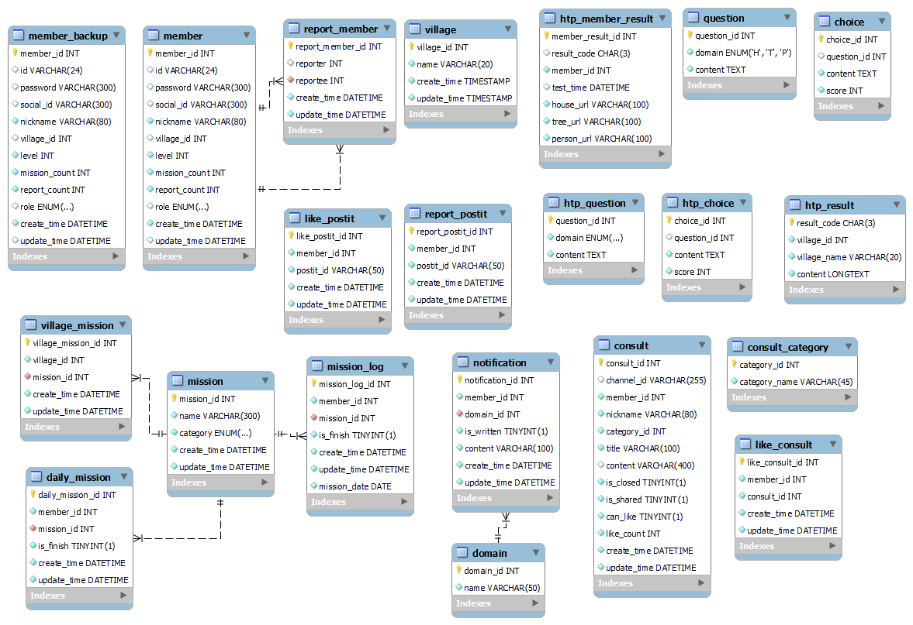
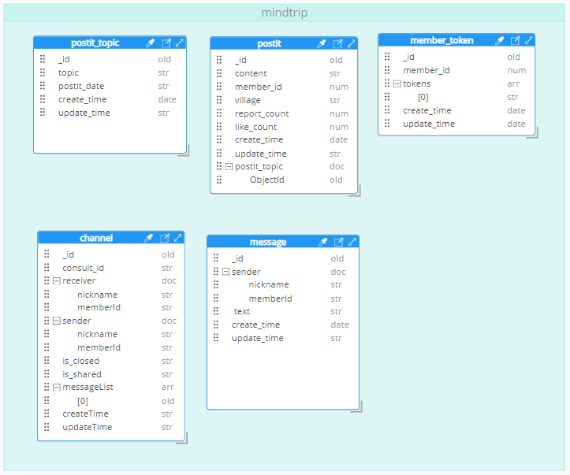
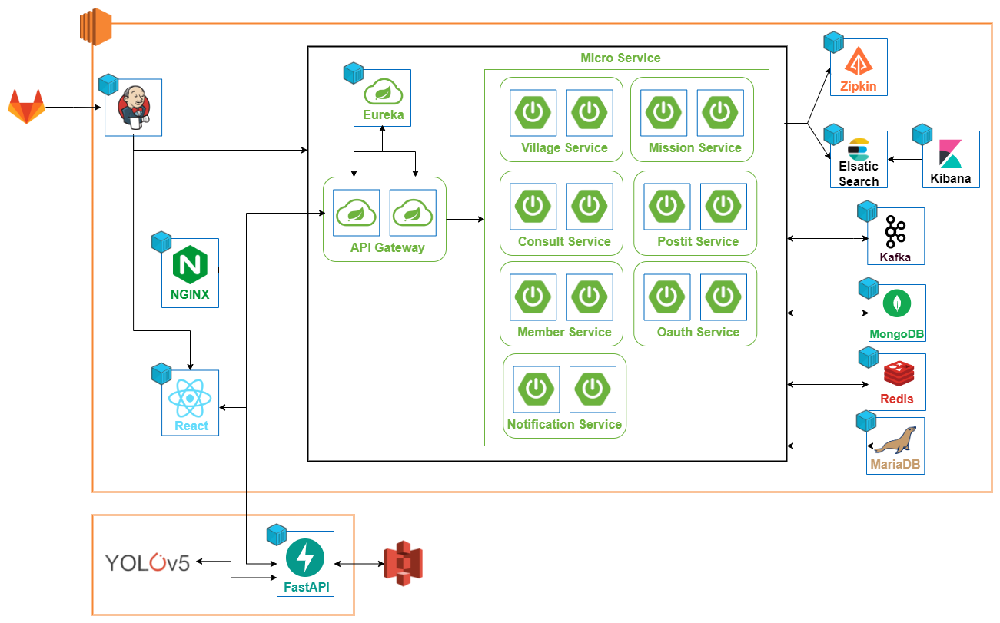
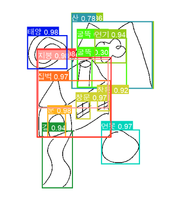
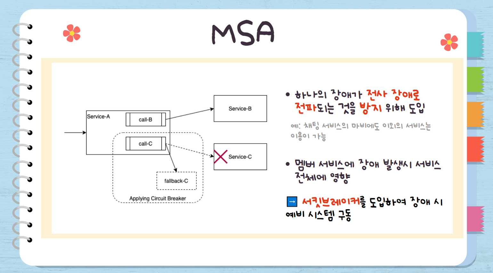
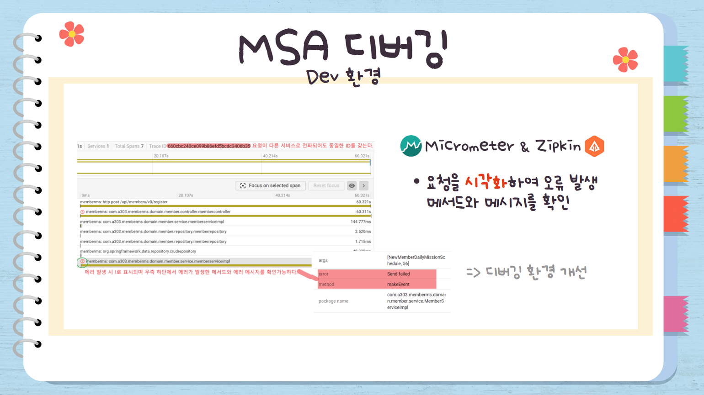
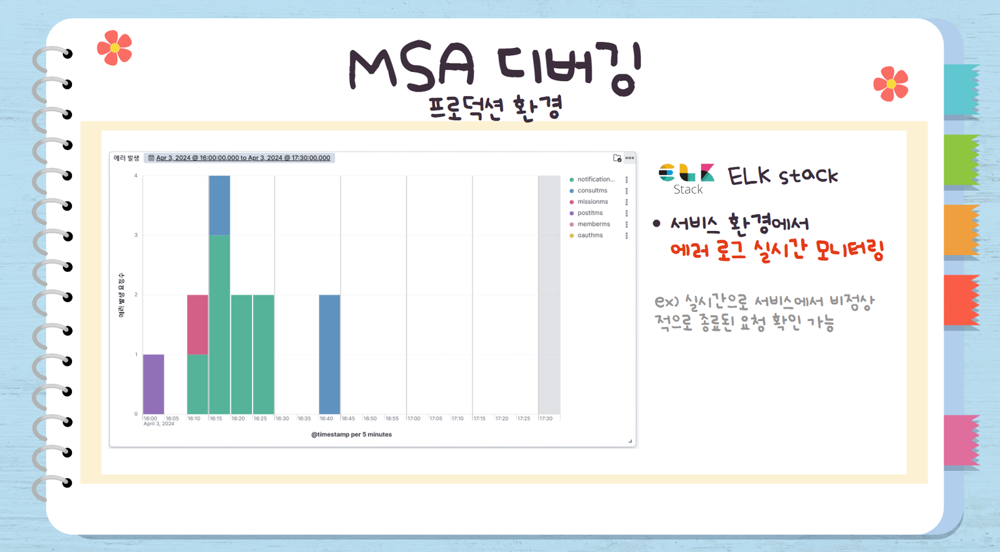

<div align="center">
  <br />
    <h1>나여</h1>
    <h2>나를 위한 여정</h2>

### 🎬[Demo 시연영상](https://youtu.be/_g9i4IPfLvI)
💡삼성 청년 SW 아카데미💡     
📆2024.02.26 ~ 2024.04.05📆
<hr >

<h4>AI 기반의 HTP 검사를 통해 사용자의 심리상태를 진단하고,데일리 미션, 포스트잇 커뮤니티, 고민 상담소 등 마음을 치유하는 서비스 제공하는 마음 치료 서비스</h4>

</div>


## 목차
|<center>No</center>|<center>내용</center>|
|:----:|:----:|
|**1**|[**💡 프로젝트 개요**](#1)
|**2**|[**🗒 주요 기능**](#2)
|**3**|[**🔍 기술 스택**](#3)
|**4**|[**💾 DataBase**](#4)
|**5**|[**📂 시스템 아키텍처**](#5) 
|**6**|[**📱 기술 소개**](#6)
|**7**|[**👪 팀 소개**](#7)
|**8**|[**🗂️ Directory 구조**](#8)


<div id="1"></div>
  
## 💡 프로젝트 개요
```
2022년 청년 삶 실태조사 결과, 최근 1년 번아웃 경험 34%, 우울증 경험 6.1%로 청년층이 심리적으로 어려움을 호소하지만, 이에 대해 도움을 청할 사람이 없다는 문제점을 인식하였습니다. 저희는 그림을 통해 개인의 내면 세계와 성격 특성 등을 파악하는 심리 검사인 HTP 검사를 통해 현재 자신의 마음 상태를 파악하고, 마음을 치유하는 다양한 맞춤형 서비스를 제공하고자 이 프로젝트를 기획하게 되었습니다.
```

<div id="2"></div>

## 🗒 주요 기능
- **HTP 검사**: 집, 나무, 사람 그림을 그리고 질문에 대해 답변을 통해, 개인의 내면 세계와 성격 특성 등을 파악해서 결과를 분석해줍니다. 또한, 분석 결과를 8가지 유형의 마을로 분류하여 맞춤형 서비스를 제공합니다.
- **데일리미션**: 8가지 유형으로 분류된 마을에 따라 마음을 치유할 수 있는 행동 리스트를 제공합니다. 건강한 생활 습관 형성을 통해 개인의 변화를 유도합니다.
- **고민상담소**: 실시간 채팅을 통해 익명으로 1:1 고민 상담을 진행합니다. 편안하게 자신의 감정과 고민을 공유할 수 있습니다.
- **포스트잇 커뮤니티**: 매일 자신을 알아가는 질문을 제공하고, 하나의 포스트잇을 등록함으로써 생각을 공유하고 공감할 수 있습니다.

### 초기 화면


### HTP 검사


### 메인 화면


### 데일리 미션


### 고민 상담소


### 포스트잇 커뮤니티


### 마이페이지


### 알람




### 마을별 다른 테마 적용


- 검사의 결과로 나온 마을 별로 테마를 모두 다르게 적용해서 마을에 대한 소속감을 주고자 했습니다.
redux에 저장된 사용자 마을 타입과 tailwindCSS를 이용해 적용했습니다

<div id="3"></div>

## 🔍 기술 스택
### FrontEnd
   
         

### BackEnd
            

### DataBase

  

### Infra

      

### Collaboration Tool
     

<div id="4"></div>

## 💾 DataBase
### Maria DB ERD

 

### Mongo DB 구조
 

<div id="5"></div>

## 📂 시스템 아키텍처
 

<div id="6"></div>

## 📱 기술 소개

### 3D 모델 랜더링

> Blender를 사용하여 만든 3D glb 파일을 웹에서 렌더링하기 위해 three.js와 react three fiber(r3f)를 사용했습니다. 이를 통해 사용자는 메인 화면에서 확대, 이동, 회전 등의 상호작용을 할 수 있습니다. 또한, 용량이 큰 3D 파일을 로딩할 때 사용자의 불편함을 최소화하기 위해 lazy loading을 적용하여, 파일이 렌더링 중일 때에는 다른 화면이 표시되도록 했습니다.


### AI

> 그림의 요소를 탐색 하기 위해 Object Detection 모델인 YOLOv5 모델을 사용하였습니다. 모델은 2022년 고양시에서 진행한 AI 기반 아동 미술심리 진단을 위한 그림 데이터 구축 프로젝트의 사전 학습 모델을 활용했습니다.

**AI 서버**
- YOLOv5가 Pytorch로 작성되어 있기 때문에, 서버 역시 Python을 사용해 구축했습니다. 파일 업로드 등 비동기 처리가 필요한 부분이 많고, 빠른 개발을 위해 Django나 Flask에 비해 구조가 단순한 FastAPI를 활용했습니다.

**메시지 큐**
- 객체 탐지에는 서버의 현재 상태에 따라 짧게는 1분, 길게는 5분 이상의 시간이 소요됩니다. 따라서 메시지 큐를 사용해 요청부터 응답까지의 시간을 최소화하고, 시스템 부하를 줄이고자 했습니다.
메시지 큐를 통해 처리되는 데이터의 용량이 크지 않고 요청된 순서대로 처리되게 하기 위해 Kafka가 아닌 RabbitMQ를 활용했습니다.

**AI 검사 로직**
1. 이미지 전처리를 통한 검사 품질 향상
    - 투명한 이미지에 흰색 배경 추가
    - 1280 * 1280 사이즈 변경
2. YOLOv5를 통한 객체 탐지

     

3. HTP 검사로직
    - 필수 요소의 존재 여부 검사
        - 집: 지붕, 벽, 문, 창문
        - 나무: 기둥, 가지, 뿌리, 나뭇잎
        - 사람: 머리, 팔, 다리, 눈, 코, 입, 귀, 손, 발
    - 각 요소 별 평가
        - 집: 창문이 너무 많은가?
        - 나무: 열매가 너무 많은가?

### MSA
> 하나의 서비스(기능)가 다운되더라도 다른 서비스(기능)은 이용할 수 있도록 Spring Eureka, Gateway, Kafka를 활용하여 이벤트 기반의 마이크로서비스 아키텍쳐를 구성하였습니다.

**서킷브레이커**
- 멤버 서비스는 다른 서비스들과 동기적으로 연관되어있습니다. 따라서 멤버 서비스의 장애는 전사 장애로 전파됩니다. 따라서 서킷브레이커를 도입하여 멤버서비스에 장애가 생겼을 때 스케쥴링된 읽기용 멤버 DB를 활용하여 데이터를 정상적으로 반환하도록 하였습니다.

 

### 모니터링 시스템
> 마이크로서비스 아키텍쳐에서는 하나의 요청이 여러 다른 서비스로 전파됩니다. 따라서 micrometer를 도입하여 하나의 요청에서 전파되더라도 같은 traceId로 관리되게 하였습니다. 또한 분리된 서비스로 인해 서버에서의 디버깅이 어렵다는 문제가 있었습니다. <br > 아래 두가지를 활용하여 디버깅 환경을 개선하였고 모니터링 도입 전주 대비 스프린트 미수행 이슈를 50% 줄이며 개발 속도를 개선하였습니다.

**Zipkin**
- traceId 단위로 요청을 시각화하였고, 즉시 오류 발생 메서드와 메시지를 확인할 수 있게 하였습니다.

 

**ELK**
- 각 마이크로서비스에서 발생하는 로그를 Logstash로 수집하였습니다. Kibana에서 최근 2시간동안 발생한 유니크한 traceId 대시보드를 구축하여 서비스 환경에서 에러 요청을 실시간으로 모니터링 할 수 있었습니다.

 

### 무중단 배포
> MSA 구조에서 마이크로 서비스를 Eureka 서버에 등록하는 데 약 1분 정도의 delay가 발생하였습니다. 1분간 서비스가 정상적으로 동작하지 못하기에 Blue-Green 방식의 무중단 배포를 적용하였습니다.

**Blue-Green 배포**
- 새 버전(Green)이 연결되는 동안 이전 버전(Blue)이 계속 서비스를 제공합니다. 연결이 완료되면 새 버전이 동작하고 이전 버전을 중단됩니다. 

### 통합 알림 시스템 구축(ver1: SSE+Kafka ver2: FCM+Kafka)
- 각 마이크로서비스에서 Kafka를 활용하여 이벤트를 등록합니다. NotificationMS는 해당 Topic을 구독하여 이벤트를 수신하고, 알림을 DB에 저장하고 ver1: SSE ver2: FCM을 활용하여 알림을 클라이언트에게 전송합니다.

### 벌크 CUD 쿼리 최적화
- JPA saveAll/deleteAll 메서드는 DB세션을 한번만 연다는 점에서 for문을 통한 save/delete 메서드보다 빠릅니다. 하지만 이 또한 개별 insert/delete 쿼리를 여러번 실행한다는 단점이 있습니다. daily_mission의 경우 매일 12시 기존 테이블을 mission_log테이블에 추가하고, 전체 유저별로 3개의 미션을 추천하여 다시 넣어주는 작업이 필요합니다. 이때에 JDBC Template을 활용하여 벌크 CUD쿼리를 최적화하였습니다.

### WebSocket + Stomp
- 실시간 채팅기능 개발을 위해 양방향 통신을 제공하는 표준 프로토콜인 WebSocket을 사용하여 클라이언트와 서버 간에 지속적인 연결을 유지하고 데이터를 주고받도록 했습니다.

- 웹 소켓을 기반으로 Stomp 메시징 프로토콜을 활용하여, 메시지 구독 및 발행(Publish/Subscribe) 패턴을 통해 서버와 클라이언트 간 상호작용이 더욱 효율적으로 이루어질 수 있도록 했습니다.


### WAS
**사용자 기능**
- 로그인과 회원가입을 구현했습니다. username과 password를 사용하는 일반적인 로그인을 구현했고, 패스워드는 BCrypt로 단방향 암호화해 저장했습니다.

**인증 기능**
- JWT에는 토큰 만료 여부를 확인하기 위한 iat, exp 클레임과 사용자 인증을 위한 memberId 등을 포함합니다. 패스워드 등 민감 정보는 토큰에 포함되지 않습니다.

<div id="7"></div>

## 👪 팀 소개
|||||||
|:----:|:----:|:----:|:----:|:----:|:----:|
|[하동준<br >(팀장)](https://github.com/djh0211)|[남수진](https://github.com/ss0510s)|[정유경](https://github.com/YuKyung-Chung)|[신종욱](https://github.com/beyondthemist)|[김예지](https://github.com/gimezi)|[김동현](https://github.com/Chico0902/)|


|<center>이름</center>|<center>역할</center>|<center>개발 내용</center>|어려웠던 점과 배운 점|
|:----:|:----:|----|----|
|하동준|BackEnd|- 이벤트 기반의 스프링 클라우드 MSA 프로젝트 세팅 <br > - 서킷브레이커 도입하여 멤버 서비스 예비 시스템 가동 <br > - 로그 및 사용자 요청 모니터링 시스템 구축(Zipkin, ELK stack) <br > - 통합 알림 시스템 구축(ver1: SSE+Kafka ver2: FCM+Kafka) <br >- 데일리미션 관련 API 개발|- 스프링 클라우드 MSA 개발에서 각 요소들이 왜 필요한지, 어떻게 사용되는지 알 수 있었습니다. 클라우드 컨피그 및 쿠버네티스를 활용하지 못하여 MSA의 여러 장점을 쓰지 못하여 아쉽습니다. <br > - 카프카의 작동 원리 및 Spring 에서의 개발 방법을 알 수 있었습니다. 카프카를 활용하여 SAGA패턴을 구현해보았고 프론트와 연동하여 동기/비동기 처리가 언제 적용되는지에 대해 알 수 있었습니다. <br > - REST통신 외에 소켓통신/SSE/메세지큐를 사용해보았습니다.|
|남수진|Infra & BackEnd| - Nginx, Docker를 이용한 서버 구축 <br > - Jenkins를 통한 CI/CD 구현 <br > - Blue-Green 무중단 배포 구현 <br > - 'JPA', 'MongoTemplate'을 통한 포스트잇 API 구현 및 'redis'를 이용한 성능 최적화 | - 서버에서 발생하는 다양한 이슈들을 해결하면서 서버가 어떻게 동작하고 유지시키는지 학습할 수 있었습니다. 또한, 무중단 배포와 배포 자동화를 통해 안정적인 서비스를 운영할 수 있었습니다. <br > - 제한된 메모리 안에서 많은 서비스를 제공하려다 보니 메모리 부족 현상이 발생하였습니다. 그래서 서비스의 메모리 상태를 관찰하고, 서비스 운영 및 성능 상 문제가 없는 컨테이너 위주로 최대 메모리 사용 제한을 두었습니다. 또한, 15G인 메모리 용량에 따라 8G의 Swap 공간을 설정하여 서버 다운을 방지하였습니다. |
|정유경|BackEnd|- DB 설계 <br > - 'JPA', 'QueryDSL'을 활용한 고민상담소 API 개발 <br > - 좋아요 등록/삭제 Redis 적용 <br > - Stomp를 이용한 실시간 채팅 기능 개발 <br > &emsp;- MongoDB 구축 <br > &emsp;- BackEnd: 1:1 통신 구현 <br > &emsp;- FrontEnd: stomp 소켓 통신 API 연결 및 구현|- 어려웠던 점 <br > &emsp;- MSA 기반 분산 서버 환경에서 개발을 진행하며, 한 서비스에서 통신 장애가 발생했을 경우 전사 장애로 이어져 개발에 어려움을 겪었습니다. <br > &emsp;- API에 에러가 발생했을 시, gateway, nginx, Database, 타 서비스 등 다양한 오류의 원인이 존재하여 디버깅에 어려움이 있었습니다. <br > &emsp;- stomp를 활용하여 소켓 통신을 구현하며, local 환경에서는 잘 작동하던 기능이 server 환경에서 작동하지 않는 오류를 마주했습니다. <br > - 배운 점 <br > &emsp;- MSA 환경에서는 서비스 간의 격리와 회복력을 강화하는 것이 중요하다는 것을 깨달았고, Circuit Breaker 패턴과 같은 장애 회복 메커니즘을 적용하는 등의 방법을 고려해야 한다는 것을 배웠습니다. <br > &emsp;- 오류 발생 시 zipkin을 활용하여 분산 시스템에서 발생한 요청의 흐름을 추적하고, 전체 시스템의 동작을 파악할 수 있었습니다. 특정 요청이 어느 서비스에서 실패했는지를 추적하고, 오류가 발생한 서비스의 로그 및 응답 시간을 분석하여 문제를 해결하는 능력을 길렀습니다. <br > &emsp;- stomp를 사용한 소켓 통신에서 발생하는 문제를 해결하면서, 서버 환경과 로컬 환경 간의 차이를 이해하고 대응하는 능력을 길렀습니다.|
|신종욱|AI & BackEnd|- FastAPI를 활용한 API 서버 구축 <br > - YOLOv5와 Message queue를 활용한 AI 서버 구축 <br > - 사용자 로그인, 회원가입 <br > - JWT 발급 및 검증|- 익명 사용자에 대한 인증 처리를 경험했습니다. 익명 사용자도 HTP 검사를 할 수 있고, 회원 가입시 이 결과를 DB에 저장해야 했는데, JWT와 UUID를 사용해 해결했습니다. <br > - message queue를 어떤 경우에 사용하면 좋은지, 그리고 어떤 문제가 발생할 수 있는지 배웠습니다. message로 parameter를 전달함으로써 해결했습니다. <br > - message queue를 사용하면서 동시성 이슈가 발생했습니다. publish된 메시지 처리를 기다리는 상황에서 한 변수를 여러 요청에서 참조하기 때문에 발생한 문제였고, Redis를 활용해 해결했습니다.|
|김예지|FrontEnd|- Figma를 이용한 프로토타입 구성 <br > - 화면 구현(HTP검사, 메인페이지, 고민상담소, 회원, 마이페이지) <br > - HTP 검사를 위한 그림 그리기 구현 <br > - Redux를 이용한 상태관리 <br > - three.js와 r3f를 이용한 3D모델 랜더링|- 그림 검사를 구현하기 위해 사용자에게 그림을 입력받고 백엔드에게 넘겨주는 과정을 익히는 것이 오래걸렸습니다.- 라이브러리를 사용하려다가 큰 기능이 아니란 점에서 직접 구현하면서 TS에 대해 좀 더 이해할 수 있었습니다. <br > - 사용자의 마을 타입에 따른 다른 테마를 적용시키기 위해서 tailwind CSS의 문법과 redux에 저장되어 있는 사용자 정보를 같이 사용했습니다. CSS가 랜더링되는 시간과 redux에서 정보를 가져오는 시간의 차이가 있어서 그것을 처리하는 것이 어려웠지만, 색만 저장하는 것이 아닌 문자열 전체를 저장하는 것으로 해결할 수 있었습니다. <br > - firebase와 연결하여 알림기능을 구현하며, react에서 사용자에게 알림을 주는 방법을 배울 수 있었습니다.|
|김동현|FrontEnd|- React와 TypeScript 를 활용한 SPA 구현, api를 활용한 날짜별 데이터 처리기능 <br > - atomic design에 기반한 component 및 page 관리 <br > - Figma를 이용한 프로토타입 구성 <br > - 화면 구현(데일리미션 페이지, 포스트잇 페이지, 회원 마이페이지)|- 페이지에서 달력을 활용한 기능을 구현하는데 라이브러리 사용에 어려움이 있었습니다. 또한 api 호출과정에서 비동기처리 관련 문제가 발생했습니다.<br > - 프로젝트의 구조설계를 완벽하게 하지 못하고 , 잘 지키지 못한 것 같아 아쉽습니다. 이번 프로젝트를 통해 구조설계의 중요성을 깨닫게 되었습니다. <br > - 사용자의 마을 타입에 따른 다른 테마를 적용시키고 마을별로 맞춤 미션을 제공하기 위해서  redux에 저장되어 있는 사용자 정보를 활용하는 방법을 배웠습니다. <br > - 발표시에 백엔드 기술에 대한 지식이 부족해서 발표가 어려웠습니다. 프론트엔드 직무를 하더라도 백엔드 지식을 익혀야겠다고 생각하였습니다.|

<div id="8"></div>

## 🗂️ Directory 구조

```bash
├─ ai
│  ├─ ai-server
│  │  ├─ installation-guide.txt
│  │  ├─ requirements.txt
│  │  └─ src
│  │     ├─ .env
│  │     ├─ main.py
│  │     ├─ type
│  │     │  └─ domains.py
│  │     └─ util
│  │        ├─ analyzer.py
│  │        ├─ detector.py
│  │        ├─ preprocessor.py
│  │        ├─ rabbitmq_util.py
│  │        └─ redis_util.py
│  ├─ api-server
│  │  ├─ installation-guide.txt
│  │  ├─ requirements.txt
│  │  └─ src
│  │     ├─ .env
│  │     ├─ main.py
│  │     ├─ type
│  │     │  ├─ domains.py
│  │     │  ├─ entities.py
│  │     │  └─ request.py
│  │     └─ util
│  │        ├─ jwt_util.py
│  │        ├─ mariadb_util.py
│  │        ├─ rabbitmq_util.py
│  │        ├─ redis_util.py
│  │        └─ s3_util.py
│  └─ compose
│     ├─ .env
│     └─ docker-compose.yml
├─ backend
│  ├─ ConsultMS
│  │  ├─ .gitignore
│  │  ├─ DockerFile
│  │  ├─ gradle
│  │  │  └─ wrapper
│  │  │     └─ gradle-wrapper.properties
│  │  ├─ gradlew
│  │  ├─ gradlew.bat
│  │  └─ src
│  │     ├─ main
│  │     │  ├─ java
│  │     │  │  └─ com
│  │     │  │     └─ a303
│  │     │  │        └─ consultms
│  │     │  │           ├─ ConsultMsApplication.java
│  │     │  │           ├─ domain
│  │     │  │           │  ├─ BaseEntity.java
│  │     │  │           │  ├─ channel
│  │     │  │           │  │  ├─ Channel.java
│  │     │  │           │  │  ├─ controller
│  │     │  │           │  │  │  ├─ ChannelController.java
│  │     │  │           │  │  │  └─ StompChannelController.java
│  │     │  │           │  │  ├─ dto
│  │     │  │           │  │  │  ├─ request
│  │     │  │           │  │  │  │  ├─ ChannelRegisterReq.java
│  │     │  │           │  │  │  │  ├─ ChannelReq.java
│  │     │  │           │  │  │  │  └─ PersonalChatReq.java
│  │     │  │           │  │  │  └─ response
│  │     │  │           │  │  │     ├─ ChannelInfoRes.java
│  │     │  │           │  │  │     ├─ ChannelListRes.java
│  │     │  │           │  │  │     └─ ChannelRes.java
│  │     │  │           │  │  ├─ repository
│  │     │  │           │  │  │  ├─ ChannelCustomRepository.java
│  │     │  │           │  │  │  ├─ ChannelRepository.java
│  │     │  │           │  │  │  └─ ChannelRepositoryImpl.java
│  │     │  │           │  │  └─ service
│  │     │  │           │  │     ├─ ChannelService.java
│  │     │  │           │  │     └─ ChannelServiceImpl.java
│  │     │  │           │  ├─ consult
│  │     │  │           │  │  ├─ Consult.java
│  │     │  │           │  │  ├─ ConsultCategory.java
│  │     │  │           │  │  ├─ controller
│  │     │  │           │  │  │  └─ ConsultController.java
│  │     │  │           │  │  ├─ dto
│  │     │  │           │  │  │  ├─ request
│  │     │  │           │  │  │  │  ├─ ConsultCloseReq.java
│  │     │  │           │  │  │  │  ├─ ConsultRegisterReq.java
│  │     │  │           │  │  │  │  └─ ConsultUpdateReq.java
│  │     │  │           │  │  │  └─ response
│  │     │  │           │  │  │     ├─ ConsultCategoryListRes.java
│  │     │  │           │  │  │     ├─ ConsultCategoryRes.java
│  │     │  │           │  │  │     ├─ ConsultChattingListRes.java
│  │     │  │           │  │  │     ├─ ConsultChattingRes.java
│  │     │  │           │  │  │     ├─ ConsultDetailRes.java
│  │     │  │           │  │  │     └─ ConsultListRes.java
│  │     │  │           │  │  ├─ repository
│  │     │  │           │  │  │  ├─ ConsultCategoryRepository.java
│  │     │  │           │  │  │  ├─ ConsultCustomRepository.java
│  │     │  │           │  │  │  ├─ ConsultRepository.java
│  │     │  │           │  │  │  └─ ConsultRepositoryImpl.java
│  │     │  │           │  │  └─ service
│  │     │  │           │  │     ├─ ConsultScheduler.java
│  │     │  │           │  │     ├─ ConsultService.java
│  │     │  │           │  │     └─ ConsultServiceImpl.java
│  │     │  │           │  ├─ consultLike
│  │     │  │           │  │  ├─ LikeConsult.java
│  │     │  │           │  │  └─ repository
│  │     │  │           │  │     └─ LikeConsultRepository.java
│  │     │  │           │  ├─ member
│  │     │  │           │  │  ├─ dto
│  │     │  │           │  │  │  └─ response
│  │     │  │           │  │  │     ├─ MemberBaseRes.java
│  │     │  │           │  │  │     └─ MemberRes.java
│  │     │  │           │  │  └─ Role.java
│  │     │  │           │  ├─ message
│  │     │  │           │  │  ├─ dto
│  │     │  │           │  │  │  ├─ request
│  │     │  │           │  │  │  │  └─ MessageReq.java
│  │     │  │           │  │  │  └─ response
│  │     │  │           │  │  │     └─ MessageRes.java
│  │     │  │           │  │  ├─ Message.java
│  │     │  │           │  │  ├─ repository
│  │     │  │           │  │  │  └─ MessageRepository.java
│  │     │  │           │  │  ├─ Seq.java
│  │     │  │           │  │  └─ service
│  │     │  │           │  │     ├─ MessageService.java
│  │     │  │           │  │     └─ MessageServiceImpl.java
│  │     │  │           │  ├─ MongoBaseEntity.java
│  │     │  │           │  └─ notification
│  │     │  │           │     └─ dto
│  │     │  │           │        └─ response
│  │     │  │           │           └─ NotificationEventDto.java
│  │     │  │           └─ global
│  │     │  │              ├─ api
│  │     │  │              │  └─ response
│  │     │  │              │     ├─ BaseResponse.java
│  │     │  │              │     └─ ErrorResponse.java
│  │     │  │              ├─ client
│  │     │  │              │  ├─ MemberClient.java
│  │     │  │              │  └─ NotificationClient.java
│  │     │  │              ├─ config
│  │     │  │              │  ├─ jpa
│  │     │  │              │  │  └─ JpaRepositoryConfig.java
│  │     │  │              │  ├─ kafka
│  │     │  │              │  │  ├─ ConsumerConfiguration.java
│  │     │  │              │  │  ├─ KafkaChatConstants.java
│  │     │  │              │  │  └─ KafkaProducerConfig.java
│  │     │  │              │  ├─ mongo
│  │     │  │              │  │  └─ MongoDbConfig.java
│  │     │  │              │  ├─ queryDsl
│  │     │  │              │  │  └─ QueryDslConfig.java
│  │     │  │              │  ├─ redis
│  │     │  │              │  │  └─ RedisConfig.java
│  │     │  │              │  └─ websocket
│  │     │  │              │     ├─ StompHandler.java
│  │     │  │              │     └─ WebSocketConfiguration.java
│  │     │  │              ├─ exception
│  │     │  │              │  ├─ BaseExceptionHandler.java
│  │     │  │              │  ├─ code
│  │     │  │              │  │  ├─ ErrorCode.java
│  │     │  │              │  │  └─ SuccessCode.java
│  │     │  │              │  └─ GlobalControllerAdvice.java
│  │     │  │              ├─ security
│  │     │  │              │  └─ exception
│  │     │  │              │     └─ AccessTokenException.java
│  │     │  │              └─ util
│  │     │  │                 ├─ S3Util.java
│  │     │  │                 ├─ TraceAspect.java
│  │     │  │                 ├─ UserContext.java
│  │     │  │                 ├─ UserContextFilter.java
│  │     │  │                 ├─ UserContextHolder.java
│  │     │  │                 └─ UserContextInterceptor.java
│  │     │  └─ resources
│  │     │     ├─ application.yml
│  │     │     └─ logback-spring.xml
│  │     └─ test
│  │        └─ java
│  │           └─ com
│  │              └─ a303
│  │                 └─ consultms
│  │                    └─ ConsultMsApplicationTests.java
│  ├─ EurekaMS
│  │  ├─ .gitignore
│  │  ├─ DockerFile
│  │  ├─ gradle
│  │  │  └─ wrapper
│  │  │     └─ gradle-wrapper.properties
│  │  ├─ gradlew
│  │  ├─ gradlew.bat
│  │  └─ src
│  │     ├─ main
│  │     │  ├─ java
│  │     │  │  └─ com
│  │     │  │     └─ a303
│  │     │  │        └─ eurekams
│  │     │  │           └─ EurekaMsApplication.java
│  │     │  └─ resources
│  │     │     └─ application.yml
│  │     └─ test
│  │        └─ java
│  │           └─ com
│  │              └─ a303
│  │                 └─ eurekams
│  │                    └─ EurekaMsApplicationTests.java
│  ├─ gatewayMS
│  │  ├─ .gitignore
│  │  ├─ DockerFile
│  │  ├─ gradle
│  │  │  └─ wrapper
│  │  │     └─ gradle-wrapper.properties
│  │  ├─ gradlew
│  │  ├─ gradlew.bat
│  │  └─ src
│  │     ├─ main
│  │     │  ├─ java
│  │     │  │  └─ com
│  │     │  │     └─ a303
│  │     │  │        └─ gatewayms
│  │     │  │           ├─ config
│  │     │  │           ├─ filters
│  │     │  │           │  ├─ AuthorizationHeaderFilter.java
│  │     │  │           │  ├─ FilterUtils.java
│  │     │  │           │  ├─ ResponseFilter.java
│  │     │  │           │  └─ TrackingFilter.java
│  │     │  │           └─ GatewayMsApplication.java
│  │     │  └─ resources
│  │     │     └─ application.yml
│  │     └─ test
│  │        └─ java
│  │           └─ com
│  │              └─ a303
│  │                 └─ gatewayms
│  │                    └─ GatewayMsApplicationTests.java
│  ├─ HtpMS
│  │  ├─ .gitignore
│  │  ├─ DockerFile
│  │  ├─ gradle
│  │  │  └─ wrapper
│  │  │     └─ gradle-wrapper.properties
│  │  ├─ gradlew
│  │  ├─ gradlew.bat
│  │  └─ src
│  │     ├─ main
│  │     │  └─ java
│  │     │     └─ com
│  │     │        └─ a303
│  │     │           └─ htpms
│  │     │              ├─ domain
│  │     │              │  ├─ BaseEntity.java
│  │     │              │  └─ htp
│  │     │              │     ├─ controller
│  │     │              │     │  └─ HtpController.java
│  │     │              │     └─ service
│  │     │              │        ├─ HtpService.java
│  │     │              │        └─ HtpServiceImpl.java
│  │     │              ├─ global
│  │     │              │  ├─ api
│  │     │              │  │  └─ response
│  │     │              │  │     ├─ BaseResponse.java
│  │     │              │  │     └─ ErrorResponse.java
│  │     │              │  ├─ config
│  │     │              │  │  ├─ jpa
│  │     │              │  │  │  └─ JpaRepositoryConfig.java
│  │     │              │  │  └─ queryDsl
│  │     │              │  │     └─ QueryDslConfig.java
│  │     │              │  ├─ exception
│  │     │              │  │  ├─ BaseExceptionHandler.java
│  │     │              │  │  ├─ code
│  │     │              │  │  │  ├─ ErrorCode.java
│  │     │              │  │  │  └─ SuccessCode.java
│  │     │              │  │  └─ GlobalControllerAdvice.java
│  │     │              │  └─ util
│  │     │              │     ├─ S3Util.java
│  │     │              │     ├─ TraceAspect.java
│  │     │              │     ├─ UserContext.java
│  │     │              │     ├─ UserContextFilter.java
│  │     │              │     ├─ UserContextHolder.java
│  │     │              │     └─ UserContextInterceptor.java
│  │     │              └─ HtpMsApplication.java
│  │     └─ test
│  │        └─ java
│  │           └─ com
│  │              └─ a303
│  │                 └─ htpms
│  │                    └─ HtpMsApplicationTests.java
│  ├─ MemberMS
│  │  ├─ .gitignore
│  │  ├─ DockerFile
│  │  ├─ gradle
│  │  │  └─ wrapper
│  │  │     └─ gradle-wrapper.properties
│  │  ├─ gradlew
│  │  ├─ gradlew.bat
│  │  └─ src
│  │     ├─ main
│  │     │  ├─ java
│  │     │  │  └─ com
│  │     │  │     └─ a303
│  │     │  │        └─ memberms
│  │     │  │           ├─ domain
│  │     │  │           │  ├─ BaseEntity.java
│  │     │  │           │  ├─ member
│  │     │  │           │  │  ├─ config
│  │     │  │           │  │  │  └─ MemberConfig.java
│  │     │  │           │  │  ├─ controller
│  │     │  │           │  │  │  └─ MemberController.java
│  │     │  │           │  │  ├─ dto
│  │     │  │           │  │  │  ├─ request
│  │     │  │           │  │  │  │  ├─ AuthTokenReq.java
│  │     │  │           │  │  │  │  ├─ MemberStandardLoginReq.java
│  │     │  │           │  │  │  │  └─ MemberStandardRegisterReq.java
│  │     │  │           │  │  │  └─ response
│  │     │  │           │  │  │     ├─ MemberBaseRes.java
│  │     │  │           │  │  │     └─ MemberLoginRes.java
│  │     │  │           │  │  ├─ Member.java
│  │     │  │           │  │  ├─ repository
│  │     │  │           │  │  │  ├─ MemberRepository.java
│  │     │  │           │  │  │  ├─ MemberRepositoryCustom.java
│  │     │  │           │  │  │  └─ MemberRepositoryImpl.java
│  │     │  │           │  │  ├─ Role.java
│  │     │  │           │  │  └─ service
│  │     │  │           │  │     ├─ MemberService.java
│  │     │  │           │  │     └─ MemberServiceImpl.java
│  │     │  │           │  ├─ notification
│  │     │  │           │  │  └─ dto
│  │     │  │           │  │     └─ response
│  │     │  │           │  │        └─ NotificationEventDto.java
│  │     │  │           │  ├─ reportMember
│  │     │  │           │  │  └─ ReportMember.java
│  │     │  │           │  └─ village
│  │     │  │           │     └─ dto
│  │     │  │           │        └─ response
│  │     │  │           │           └─ VillageBaseRes.java
│  │     │  │           ├─ global
│  │     │  │           │  ├─ api
│  │     │  │           │  │  └─ response
│  │     │  │           │  │     ├─ BaseResponse.java
│  │     │  │           │  │     └─ ErrorResponse.java
│  │     │  │           │  ├─ client
│  │     │  │           │  │  ├─ AuthClient.java
│  │     │  │           │  │  └─ VillageClient.java
│  │     │  │           │  ├─ config
│  │     │  │           │  │  ├─ jpa
│  │     │  │           │  │  │  └─ JpaRepositoryConfig.java
│  │     │  │           │  │  └─ queryDsl
│  │     │  │           │  │     └─ QueryDslConfig.java
│  │     │  │           │  ├─ exception
│  │     │  │           │  │  ├─ BaseExceptionHandler.java
│  │     │  │           │  │  ├─ code
│  │     │  │           │  │  │  ├─ ErrorCode.java
│  │     │  │           │  │  │  └─ SuccessCode.java
│  │     │  │           │  │  └─ GlobalControllerAdvice.java
│  │     │  │           │  └─ util
│  │     │  │           │     ├─ S3Util.java
│  │     │  │           │     ├─ TraceAspect.java
│  │     │  │           │     ├─ UserContext.java
│  │     │  │           │     ├─ UserContextFilter.java
│  │     │  │           │     ├─ UserContextHolder.java
│  │     │  │           │     └─ UserContextInterceptor.java
│  │     │  │           └─ MemberMsApplication.java
│  │     │  └─ resources
│  │     │     ├─ application.yml
│  │     │     └─ logback-spring.xml
│  │     └─ test
│  │        └─ java
│  │           └─ com
│  │              └─ a303
│  │                 └─ memberms
│  │                    └─ MemberMsApplicationTests.java
│  ├─ MissionMS
│  │  ├─ .gitignore
│  │  ├─ DockerFile
│  │  ├─ gradle
│  │  │  └─ wrapper
│  │  │     └─ gradle-wrapper.properties
│  │  ├─ gradlew
│  │  ├─ gradlew.bat
│  │  └─ src
│  │     ├─ main
│  │     │  ├─ java
│  │     │  │  └─ com
│  │     │  │     └─ a303
│  │     │  │        └─ missionms
│  │     │  │           ├─ domain
│  │     │  │           │  ├─ BaseEntity.java
│  │     │  │           │  ├─ dailyMission
│  │     │  │           │  │  ├─ DailyMission.java
│  │     │  │           │  │  ├─ repository
│  │     │  │           │  │  │  ├─ DailyMissionRepository.java
│  │     │  │           │  │  │  ├─ DailyMissionRepositoryCustom.java
│  │     │  │           │  │  │  └─ DailyMissionRepositoryImpl.java
│  │     │  │           │  │  └─ service
│  │     │  │           │  │     ├─ DailyMissionScheduler.java
│  │     │  │           │  │     ├─ DailyMissionService.java
│  │     │  │           │  │     └─ DailyMissionServiceImpl.java
│  │     │  │           │  ├─ member
│  │     │  │           │  │  ├─ dto
│  │     │  │           │  │  │  └─ response
│  │     │  │           │  │  │     └─ MemberBaseRes.java
│  │     │  │           │  │  └─ Role.java
│  │     │  │           │  ├─ mission
│  │     │  │           │  │  ├─ Category.java
│  │     │  │           │  │  ├─ controller
│  │     │  │           │  │  │  └─ MissionController.java
│  │     │  │           │  │  ├─ dto
│  │     │  │           │  │  │  ├─ request
│  │     │  │           │  │  │  │  └─ MyTableMissionDTO.java
│  │     │  │           │  │  │  └─ response
│  │     │  │           │  │  │     ├─ CalenderDayMissionRes.java
│  │     │  │           │  │  │     ├─ CategoryMissionRes.java
│  │     │  │           │  │  │     ├─ DailyMissionBaseRes.java
│  │     │  │           │  │  │     ├─ MissionBaseRes.java
│  │     │  │           │  │  │     ├─ MissionListRes.java
│  │     │  │           │  │  │     ├─ MissionLogBaseRes.java
│  │     │  │           │  │  │     ├─ MissionLogRes.java
│  │     │  │           │  │  │     ├─ MissionReportRes.java
│  │     │  │           │  │  │     └─ MyTableMissionRes.java
│  │     │  │           │  │  ├─ Mission.java
│  │     │  │           │  │  ├─ repository
│  │     │  │           │  │  │  ├─ MissionBulkRepository.java
│  │     │  │           │  │  │  ├─ MissionRepository.java
│  │     │  │           │  │  │  └─ MissionRepositoryCustom.java
│  │     │  │           │  │  └─ service
│  │     │  │           │  │     ├─ MissionService.java
│  │     │  │           │  │     └─ MissionServiceImpl.java
│  │     │  │           │  ├─ missionLog
│  │     │  │           │  │  ├─ MissionLog.java
│  │     │  │           │  │  ├─ repository
│  │     │  │           │  │  │  ├─ MissionLogRepository.java
│  │     │  │           │  │  │  ├─ MissionLogRepositoryCustom.java
│  │     │  │           │  │  │  └─ MissionLogRepositoryImpl.java
│  │     │  │           │  │  └─ service
│  │     │  │           │  │     ├─ MissionLogService.java
│  │     │  │           │  │     └─ MissionLogServiceImpl.java
│  │     │  │           │  ├─ notification
│  │     │  │           │  │  └─ dto
│  │     │  │           │  │     └─ response
│  │     │  │           │  │        └─ NotificationEventDto.java
│  │     │  │           │  └─ villageMission
│  │     │  │           │     └─ VillageMission.java
│  │     │  │           ├─ global
│  │     │  │           │  ├─ api
│  │     │  │           │  │  └─ response
│  │     │  │           │  │     ├─ BaseResponse.java
│  │     │  │           │  │     └─ ErrorResponse.java
│  │     │  │           │  ├─ client
│  │     │  │           │  │  ├─ MemberClient.java
│  │     │  │           │  │  └─ NotificationClient.java
│  │     │  │           │  ├─ config
│  │     │  │           │  │  ├─ jpa
│  │     │  │           │  │  │  └─ JpaRepositoryConfig.java
│  │     │  │           │  │  ├─ kafka
│  │     │  │           │  │  │  └─ KafkaProducerConfig.java
│  │     │  │           │  │  └─ queryDsl
│  │     │  │           │  │     └─ QueryDslConfig.java
│  │     │  │           │  ├─ exception
│  │     │  │           │  │  ├─ BaseExceptionHandler.java
│  │     │  │           │  │  ├─ code
│  │     │  │           │  │  │  ├─ ErrorCode.java
│  │     │  │           │  │  │  └─ SuccessCode.java
│  │     │  │           │  │  └─ GlobalControllerAdvice.java
│  │     │  │           │  └─ util
│  │     │  │           │     ├─ S3Util.java
│  │     │  │           │     ├─ TraceAspect.java
│  │     │  │           │     ├─ UserContext.java
│  │     │  │           │     ├─ UserContextFilter.java
│  │     │  │           │     ├─ UserContextHolder.java
│  │     │  │           │     └─ UserContextInterceptor.java
│  │     │  │           └─ MissionMsApplication.java
│  │     │  └─ resources
│  │     │     ├─ application.yml
│  │     │     └─ logback-spring.xml
│  │     └─ test
│  │        └─ java
│  │           └─ com
│  │              └─ a303
│  │                 └─ missionms
│  │                    └─ MissionMsApplicationTests.java
│  ├─ NotificationMS
│  │  ├─ .gitignore
│  │  ├─ DockerFile
│  │  ├─ gradle
│  │  │  └─ wrapper
│  │  │     └─ gradle-wrapper.properties
│  │  ├─ gradlew
│  │  ├─ gradlew.bat
│  │  └─ src
│  │     ├─ main
│  │     │  └─ java
│  │     │     └─ com
│  │     │        └─ a303
│  │     │           └─ notificationms
│  │     │              ├─ domain
│  │     │              │  ├─ BaseEntity.java
│  │     │              │  ├─ domain
│  │     │              │  │  ├─ Domain.java
│  │     │              │  │  └─ repository
│  │     │              │  │     └─ DomainRepository.java
│  │     │              │  ├─ member
│  │     │              │  │  ├─ dto
│  │     │              │  │  │  └─ response
│  │     │              │  │  │     └─ MemberBaseRes.java
│  │     │              │  │  └─ Role.java
│  │     │              │  ├─ memberToken
│  │     │              │  │  ├─ MemberToken.java
│  │     │              │  │  └─ repository
│  │     │              │  │     ├─ MemberTokenCustomRepository.java
│  │     │              │  │     ├─ MemberTokenRepository.java
│  │     │              │  │     └─ MemberTokenRepositoryImpl.java
│  │     │              │  ├─ MongoBaseEntity.java
│  │     │              │  └─ notification
│  │     │              │     ├─ controller
│  │     │              │     │  └─ NotificationController.java
│  │     │              │     ├─ dto
│  │     │              │     │  ├─ NotificationEventDto.java
│  │     │              │     │  ├─ request
│  │     │              │     │  │  ├─ FCMNotificationReq.java
│  │     │              │     │  │  └─ FCMTokenReq.java
│  │     │              │     │  └─ response
│  │     │              │     │     ├─ CountNotificationMessageRes.java
│  │     │              │     │     ├─ HeartBeatNotificationMessageRes.java
│  │     │              │     │     └─ NotificationMessageRes.java
│  │     │              │     ├─ Notification.java
│  │     │              │     ├─ repository
│  │     │              │     │  ├─ NotificationBulkRepository.java
│  │     │              │     │  └─ NotificationRepository.java
│  │     │              │     └─ service
│  │     │              │        ├─ NotificationService.java
│  │     │              │        └─ NotificationServiceImpl.java
│  │     │              ├─ global
│  │     │              │  ├─ api
│  │     │              │  │  └─ response
│  │     │              │  │     ├─ BaseResponse.java
│  │     │              │  │     └─ ErrorResponse.java
│  │     │              │  ├─ client
│  │     │              │  │  └─ MemberClient.java
│  │     │              │  ├─ config
│  │     │              │  │  ├─ firebase
│  │     │              │  │  │  └─ FCMConfig.java
│  │     │              │  │  ├─ jpa
│  │     │              │  │  │  └─ JpaRepositoryConfig.java
│  │     │              │  │  ├─ kafka
│  │     │              │  │  │  └─ KafkaConsumerConfig.java
│  │     │              │  │  ├─ mongo
│  │     │              │  │  │  └─ MongoDbConfig.java
│  │     │              │  │  └─ queryDsl
│  │     │              │  │     └─ QueryDslConfig.java
│  │     │              │  ├─ exception
│  │     │              │  │  ├─ BaseExceptionHandler.java
│  │     │              │  │  ├─ code
│  │     │              │  │  │  ├─ ErrorCode.java
│  │     │              │  │  │  └─ SuccessCode.java
│  │     │              │  │  └─ GlobalControllerAdvice.java
│  │     │              │  └─ util
│  │     │              │     ├─ S3Util.java
│  │     │              │     ├─ TraceAspect.java
│  │     │              │     ├─ UserContext.java
│  │     │              │     ├─ UserContextFilter.java
│  │     │              │     ├─ UserContextHolder.java
│  │     │              │     └─ UserContextInterceptor.java
│  │     │              └─ NotificationMsApplication.java
│  │     └─ test
│  │        └─ java
│  │           └─ com
│  │              └─ a303
│  │                 └─ notificationms
│  │                    └─ NotificationMsApplicationTests.java
│  ├─ OauthMS
│  │  ├─ .gitignore
│  │  ├─ DockerFile
│  │  ├─ gradle
│  │  │  └─ wrapper
│  │  │     └─ gradle-wrapper.properties
│  │  ├─ gradlew
│  │  ├─ gradlew.bat
│  │  └─ src
│  │     ├─ main
│  │     │  ├─ java
│  │     │  │  └─ com
│  │     │  │     └─ a303
│  │     │  │        └─ oauthms
│  │     │  │           ├─ config
│  │     │  │           │  ├─ JwtConfig.java
│  │     │  │           │  └─ SecurityConfig.java
│  │     │  │           ├─ controller
│  │     │  │           │  └─ AuthController.java
│  │     │  │           ├─ domain
│  │     │  │           │  └─ dto
│  │     │  │           │     ├─ AuthTokenReq.java
│  │     │  │           │     └─ JwtAuthToken.java
│  │     │  │           ├─ global
│  │     │  │           │  ├─ api
│  │     │  │           │  │  └─ response
│  │     │  │           │  │     ├─ BaseResponse.java
│  │     │  │           │  │     └─ ErrorResponse.java
│  │     │  │           │  ├─ exception
│  │     │  │           │  │  ├─ BaseExceptionHandler.java
│  │     │  │           │  │  ├─ code
│  │     │  │           │  │  │  ├─ ErrorCode.java
│  │     │  │           │  │  │  └─ SuccessCode.java
│  │     │  │           │  │  └─ GlobalControllerAdvice.java
│  │     │  │           │  └─ util
│  │     │  │           │     ├─ S3Util.java
│  │     │  │           │     ├─ TraceAspect.java
│  │     │  │           │     ├─ UserContext.java
│  │     │  │           │     ├─ UserContextFilter.java
│  │     │  │           │     ├─ UserContextHolder.java
│  │     │  │           │     └─ UserContextInterceptor.java
│  │     │  │           ├─ OauthMsApplication.java
│  │     │  │           └─ token
│  │     │  │              ├─ AuthTokenProvider.java
│  │     │  │              └─ AuthTokenProviderImpl.java
│  │     │  └─ resources
│  │     │     └─ application.yml
│  │     └─ test
│  │        └─ java
│  │           └─ com
│  │              └─ a303
│  │                 └─ oauthms
│  │                    └─ OauthMsApplicationTests.java
│  ├─ PostitMS
│  │  ├─ .gitignore
│  │  ├─ DockerFile
│  │  ├─ gradle
│  │  │  └─ wrapper
│  │  │     └─ gradle-wrapper.properties
│  │  ├─ gradlew
│  │  ├─ gradlew.bat
│  │  └─ src
│  │     ├─ main
│  │     │  ├─ java
│  │     │  │  └─ com
│  │     │  │     └─ a303
│  │     │  │        └─ postitms
│  │     │  │           ├─ domain
│  │     │  │           │  ├─ BaseEntity.java
│  │     │  │           │  ├─ likePostit
│  │     │  │           │  │  ├─ LikePostit.java
│  │     │  │           │  │  └─ repository
│  │     │  │           │  │     └─ LikePostitRepository.java
│  │     │  │           │  ├─ member
│  │     │  │           │  │  ├─ dto
│  │     │  │           │  │  │  └─ response
│  │     │  │           │  │  │     └─ MemberBaseRes.java
│  │     │  │           │  │  └─ Role.java
│  │     │  │           │  ├─ MongoBaseEntity.java
│  │     │  │           │  ├─ postit
│  │     │  │           │  │  ├─ controller
│  │     │  │           │  │  │  └─ PostitController.java
│  │     │  │           │  │  ├─ dto
│  │     │  │           │  │  │  ├─ reponse
│  │     │  │           │  │  │  │  ├─ MyPostitRes.java
│  │     │  │           │  │  │  │  ├─ PostitRes.java
│  │     │  │           │  │  │  │  └─ PostitTopicListRes.java
│  │     │  │           │  │  │  └─ request
│  │     │  │           │  │  │     └─ PostitRegistReq.java
│  │     │  │           │  │  ├─ Postit.java
│  │     │  │           │  │  ├─ repository
│  │     │  │           │  │  │  ├─ PostitCustomRepository.java
│  │     │  │           │  │  │  ├─ PostitRepository.java
│  │     │  │           │  │  │  └─ PostitRepositoryImpl.java
│  │     │  │           │  │  └─ service
│  │     │  │           │  │     ├─ PostitScheduler.java
│  │     │  │           │  │     ├─ PostitService.java
│  │     │  │           │  │     └─ PostitServiceImpl.java
│  │     │  │           │  ├─ postitTopic
│  │     │  │           │  │  ├─ dto
│  │     │  │           │  │  │  └─ reponse
│  │     │  │           │  │  │     └─ PostitTopicRes.java
│  │     │  │           │  │  ├─ PostitTopic.java
│  │     │  │           │  │  ├─ repository
│  │     │  │           │  │  │  └─ PostitTopicRepository.java
│  │     │  │           │  │  └─ service
│  │     │  │           │  │     ├─ PostitTopicScheduler.java
│  │     │  │           │  │     ├─ PostitTopicService.java
│  │     │  │           │  │     └─ PostitTopicServiceImpl.java
│  │     │  │           │  └─ reportPostit
│  │     │  │           │     ├─ ReportPostit.java
│  │     │  │           │     └─ repository
│  │     │  │           │        └─ ReportPostitRepository.java
│  │     │  │           ├─ global
│  │     │  │           │  ├─ api
│  │     │  │           │  │  └─ response
│  │     │  │           │  │     ├─ BaseResponse.java
│  │     │  │           │  │     └─ ErrorResponse.java
│  │     │  │           │  ├─ client
│  │     │  │           │  │  └─ MemberClient.java
│  │     │  │           │  ├─ config
│  │     │  │           │  │  ├─ jpa
│  │     │  │           │  │  │  └─ JpaRepositoryConfig.java
│  │     │  │           │  │  ├─ mongo
│  │     │  │           │  │  │  └─ MongoDbConfig.java
│  │     │  │           │  │  ├─ queryDsl
│  │     │  │           │  │  │  └─ QueryDslConfig.java
│  │     │  │           │  │  └─ redis
│  │     │  │           │  │     └─ RedisConfig.java
│  │     │  │           │  ├─ exception
│  │     │  │           │  │  ├─ BaseExceptionHandler.java
│  │     │  │           │  │  ├─ code
│  │     │  │           │  │  │  ├─ ErrorCode.java
│  │     │  │           │  │  │  └─ SuccessCode.java
│  │     │  │           │  │  └─ GlobalControllerAdvice.java
│  │     │  │           │  └─ util
│  │     │  │           │     ├─ S3Util.java
│  │     │  │           │     ├─ TraceAspect.java
│  │     │  │           │     ├─ UserContext.java
│  │     │  │           │     ├─ UserContextFilter.java
│  │     │  │           │     ├─ UserContextHolder.java
│  │     │  │           │     └─ UserContextInterceptor.java
│  │     │  │           ├─ HealthController.java
│  │     │  │           └─ PostitMsApplication.java
│  │     │  └─ resources
│  │     │     ├─ application.yml
│  │     │     └─ logback-spring.xml
│  │     └─ test
│  │        └─ java
│  │           └─ com
│  │              └─ a303
│  │                 └─ postitms
│  │                    └─ PostitMsApplicationTests.java
│  └─ VillageMS
│     ├─ .gitignore
│     ├─ DockerFile
│     ├─ gradle
│     │  └─ wrapper
│     │     └─ gradle-wrapper.properties
│     ├─ gradlew
│     ├─ gradlew.bat
│     └─ src
│        ├─ main
│        │  └─ java
│        │     └─ com
│        │        └─ a303
│        │           └─ villagems
│        │              ├─ domain
│        │              │  ├─ BaseEntity.java
│        │              │  └─ village
│        │              │     ├─ controller
│        │              │     │  └─ VillageController.java
│        │              │     ├─ dto
│        │              │     │  └─ response
│        │              │     │     └─ VillageBaseRes.java
│        │              │     ├─ repository
│        │              │     │  └─ VillageRepository.java
│        │              │     ├─ service
│        │              │     │  ├─ VillageService.java
│        │              │     │  └─ VillageServiceImpl.java
│        │              │     └─ Village.java
│        │              ├─ global
│        │              │  ├─ api
│        │              │  │  └─ response
│        │              │  │     ├─ BaseResponse.java
│        │              │  │     └─ ErrorResponse.java
│        │              │  ├─ config
│        │              │  │  ├─ jpa
│        │              │  │  │  └─ JpaRepositoryConfig.java
│        │              │  │  └─ queryDsl
│        │              │  │     └─ QueryDslConfig.java
│        │              │  ├─ exception
│        │              │  │  ├─ BaseExceptionHandler.java
│        │              │  │  ├─ code
│        │              │  │  │  ├─ ErrorCode.java
│        │              │  │  │  └─ SuccessCode.java
│        │              │  │  └─ GlobalControllerAdvice.java
│        │              │  └─ util
│        │              │     ├─ S3Util.java
│        │              │     ├─ TraceAspect.java
│        │              │     ├─ UserContext.java
│        │              │     ├─ UserContextFilter.java
│        │              │     ├─ UserContextHolder.java
│        │              │     └─ UserContextInterceptor.java
│        │              └─ VillageMsApplication.java
│        └─ test
│           └─ java
│              └─ com
│                 └─ a303
│                    └─ villagems
│                       └─ VillageMsApplicationTests.java
├─ frontend
│  ├─ .env
│  ├─ .eslintrc.cjs
│  ├─ .gitignore
│  ├─ Dockerfile
│  ├─ index.html
│  ├─ nginx.conf
│  ├─ package-lock.json
│  ├─ package.json
│  ├─ postcss.config.js
│  ├─ public
│  │  ├─ firebase-messaging-sw.js
│  │  ├─ Image
│  │  │  ├─ apple.png
│  │  │  ├─ blueberry.png
│  │  │  ├─ grape.png
│  │  │  ├─ kakao.png
│  │  │  ├─ orange.png
│  │  │  ├─ peach.png
│  │  │  ├─ pineapple.png
│  │  │  └─ watermelon.png
│  │  ├─ models
│  │  │  ├─ base.glb
│  │  │  ├─ cloud.glb
│  │  │  ├─ consult.glb
│  │  │  ├─ mission.glb
│  │  │  ├─ mypage.glb
│  │  │  └─ postit.glb
│  │  └─ sphere.glb
│  ├─ README.md
│  ├─ sonar-project.properties
│  ├─ src
│  │  ├─ api
│  │  │  ├─ consults.ts
│  │  │  ├─ htp.ts
│  │  │  └─ member.ts
│  │  ├─ App.tsx
│  │  ├─ assets
│  │  │  ├─ imoticon
│  │  │  │  ├─ badimo.png
│  │  │  │  ├─ goodimo.png
│  │  │  │  └─ sosoimo.png
│  │  │  ├─ levelupbadge
│  │  │  │  ├─ 나무.png
│  │  │  │  ├─ 나뭇가지.png
│  │  │  │  ├─ 새싹.png
│  │  │  │  ├─ 씨앗.png
│  │  │  │  ├─ 열매.png
│  │  │  │  └─ 잎새.png
│  │  │  ├─ logo.png
│  │  │  └─ map.png
│  │  ├─ atoms
│  │  │  ├─ buttons
│  │  │  │  ├─ PostitLikeBtn.css
│  │  │  │  ├─ PostitLikeBtn.tsx
│  │  │  │  ├─ ReportBtn.tsx
│  │  │  │  └─ successbtn.tsx
│  │  │  ├─ color.ts
│  │  │  ├─ Loading.tsx
│  │  │  └─ postit
│  │  │     ├─ postit.css
│  │  │     └─ postititem.tsx
│  │  ├─ components
│  │  │  ├─ Calendar
│  │  │  │  ├─ Calendar.module.css
│  │  │  │  ├─ Calendar.tsx
│  │  │  │  ├─ ReactCalendar.css
│  │  │  │  └─ testcal.tsx
│  │  │  ├─ Consult
│  │  │  │  ├─ Chat
│  │  │  │  │  ├─ Chat.tsx
│  │  │  │  │  ├─ ChatList.tsx
│  │  │  │  │  ├─ Chatting.tsx
│  │  │  │  │  └─ ChattingAddtionalInfo.tsx
│  │  │  │  ├─ CreateNewConsult.tsx
│  │  │  │  ├─ OtherConsult.tsx
│  │  │  │  └─ SharedConsult.tsx
│  │  │  ├─ Header.tsx
│  │  │  ├─ HTP
│  │  │  │  ├─ BackGround.tsx
│  │  │  │  └─ Draw.tsx
│  │  │  ├─ HTPCard.tsx
│  │  │  ├─ Loading
│  │  │  │  ├─ MissionTree.css
│  │  │  │  └─ MissionTree.tsx
│  │  │  ├─ Main
│  │  │  │  ├─ Loader.tsx
│  │  │  │  ├─ Models
│  │  │  │  │  ├─ BaseModel.tsx
│  │  │  │  │  ├─ CloudModel.tsx
│  │  │  │  │  ├─ ConsultModel.tsx
│  │  │  │  │  ├─ MissionModel.tsx
│  │  │  │  │  ├─ MypageModel.tsx
│  │  │  │  │  └─ PostitModel.tsx
│  │  │  │  └─ TestBackground.tsx
│  │  │  ├─ missonbox
│  │  │  │  ├─ FixMissionBox.tsx
│  │  │  │  └─ MissionBox.tsx
│  │  │  ├─ MypageHTP
│  │  │  │  ├─ HTPDrawing.tsx
│  │  │  │  └─ HTPPicture.tsx
│  │  │  ├─ MyPostit
│  │  │  │  ├─ MyPostit.css
│  │  │  │  ├─ MyPostit.tsx
│  │  │  │  └─ PostitModal.tsx
│  │  │  └─ Progress
│  │  │     └─ Progress.tsx
│  │  ├─ fonts
│  │  │  ├─ JamsilRegular.otf
│  │  │  └─ JamsilThin.otf
│  │  ├─ index.css
│  │  ├─ main.tsx
│  │  ├─ pages
│  │  │  ├─ Consult
│  │  │  │  ├─ Consult.tsx
│  │  │  │  ├─ ConsultOther.tsx
│  │  │  │  └─ ConsultShared.tsx
│  │  │  ├─ HTP
│  │  │  │  ├─ House.tsx
│  │  │  │  ├─ HTP.tsx
│  │  │  │  ├─ Person.tsx
│  │  │  │  ├─ Result.tsx
│  │  │  │  └─ Tree.tsx
│  │  │  ├─ Login.tsx
│  │  │  ├─ Main.tsx
│  │  │  ├─ Mission
│  │  │  │  ├─ FixMission.tsx
│  │  │  │  └─ Mission.tsx
│  │  │  ├─ Mypage
│  │  │  │  ├─ Mypage.tsx
│  │  │  │  └─ MypageDetail
│  │  │  │     ├─ MypageCss
│  │  │  │     │  └─ MypageHTP.css
│  │  │  │     ├─ MypageHistory.tsx
│  │  │  │     ├─ MypageHTP.tsx
│  │  │  │     └─ MypageProgress.tsx
│  │  │  ├─ Postit
│  │  │  │  ├─ Postit.tsx
│  │  │  │  └─ PostitPage.css
│  │  │  ├─ Signup.tsx
│  │  │  └─ Start.tsx
│  │  ├─ services
│  │  │  ├─ chat.ts
│  │  │  └─ protectRoute.tsx
│  │  ├─ store
│  │  │  ├─ chatSlice.ts
│  │  │  ├─ consultSlice.ts
│  │  │  ├─ htpSlice.ts
│  │  │  ├─ memberSlice.ts
│  │  │  ├─ notificationSlice.ts
│  │  │  └─ store.ts
│  │  ├─ types
│  │  │  └─ DataTypes.ts
│  │  └─ vite-env.d.ts
│  ├─ tailwind.config.js
│  ├─ tsconfig.json
│  ├─ tsconfig.node.json
│  └─ vite.config.ts
├─ package-lock.json
└─ README.md

```